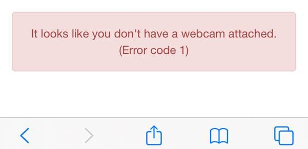
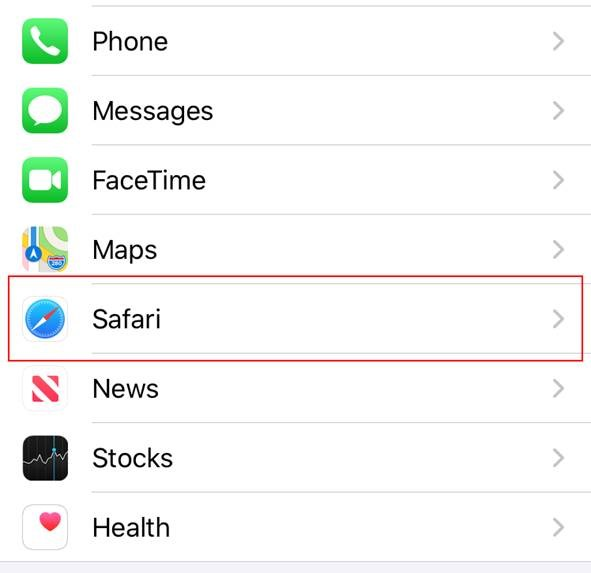
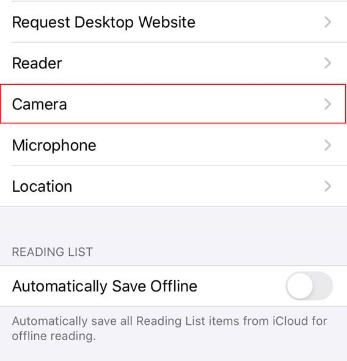
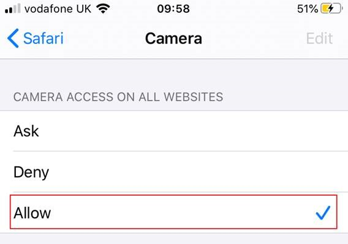

# Using OneConsultation with iOS 13.4

If you are using version an Apple device using version 13.4 of IOS and see the below error message when joining your consultation, please follow the below instructions to enable your webcam.

Go to the iPhone settings screen via the below icon

Scroll down and select Safari in the app settings section

Select **Camera**

Ensure that the **Camera Access on all websites** setting is set to **Allow**

Once complete, reload the web page in Safari and you will be able to join your consultation.
